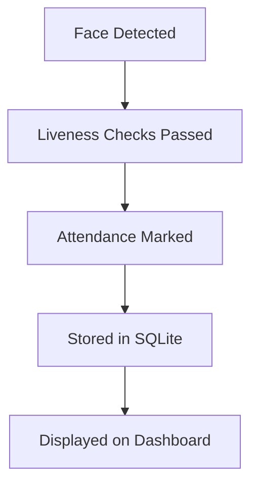

<h1 align="center">🎓 Smart Face Recognition Attendance System 🎥</h1>

<p align="center">
  Real-time face recognition + liveness detection 🔐 with a slick React dashboard 🧑‍💻  
</p>

<p align="center">
  
  
  
  
</p>

---

## 🚀 Key Features

✅ **Real-Time Face Recognition**  
✅ **Zero-Lag Liveness Detection** (blink, head, mouth)  
✅ **Anti-Spoofing Techniques**  
✅ **Admin Login + JWT Secured**  
✅ **Attendance Logging (SQLite)**  
✅ **Interactive React Dashboard**  
✅ **Face Image Management** (Delete Users)  
✅ **Fully Optimized Using OpenCV**  

---

## 🧠 Liveness Detection - How It Works

The system ensures **real presence** using:

🔹 **Blink Detection**  
🔹 **Head Movement Detection** (left/right & up/down)  
🔹 **Mouth Movement Tracking**

Only after successful checks, attendance is marked as:  
✅ `Liveness: Real` (No spoofing possible!)

---

## 📊 Web Dashboard (React + Tailwind)

👨‍💼 **Admin Features**:
- 🔐 Login securely
- 🕒 View all attendance entries
- 🧍‍♂️ See face thumbnails
- 🗑️ Delete specific registered users

Responsive, modern, and super intuitive.

---

## 📸 How To Run the Project

> Backend, Live Recognition & Dashboard — all in sync!

1. **Start Backend (Flask API)**  
   ```bash
   python backend/api.py
   ```

2. **Start Live Face Recognition System**  
   ```bash
   python backend/live_face_recognition.py
   ```

3. **Run the React Dashboard**  
   ```bash
   cd attendance-dashboard
   npm install
   npm start
   ```

Open `http://localhost:3000` to explore the dashboard 💻

---

## ⚙️ System Flow (Behind the Scenes)



---

## 🧩 Tech Stack

| Frontend        | Backend       | AI/ML           | Database |
|----------------|---------------|------------------|----------|
| React + Tailwind CSS | Flask + REST API | OpenCV, face_recognition | SQLite |

---

## 📁 Data Handling

- 📂 `known_faces/` - stores face images  
- 🧠 `encodings.pickle` - stores face encodings  
- 📄 `attendance.db` - logs timestamped attendance  
- 🧼 Deletes removed users from both disk & memory

---

## 🛡️ Security

- 🔐 JWT Token Authentication for Admin
- 🔒 Bcrypt Password Hashing
- 🔜 2FA (Two-Factor Authentication)

---

## 📌 Roadmap

- [ ] Emotion Detection (Happy, Sad, Neutral)
- [ ] Export Logs to CSV/PDF
- [ ] Cloud Deployment (with webcam access)
- [ ] Email/SMS Alerts on Attendance

---

## 👨‍🎓 About the Developer

**Sahil Sharma**  
Final Year B.Tech Student  
🎯 Passionate about AI, ML, and Secure System Design

---

## ⭐️ Show Some Love!

If you like this project, leave a ⭐ on [GitHub](#)  
Or drop a message — I'd love to hear your feedback!

---
